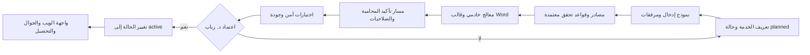
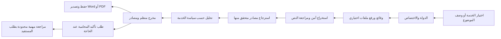
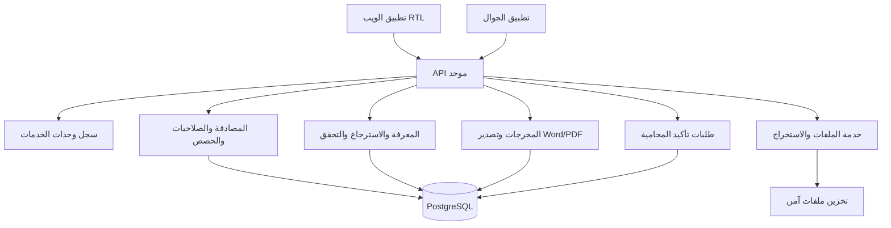

# الخطة التقنية الموحّدة لمنصة محاميتك الرقمية

**الإصدار:** 1.0  
**الحالة:** خطة معتمدة لإعادة التنظيم والتنفيذ  
**نطاق الإصدار:** الويب أولاً، مع عقود API موحّدة لتطبيق الجوال  
**المالك المهني:** المحامية والمحكّم التجاري د. رباب أحمد المعبي

## الملخص التنفيذي

**محاميتك الرقمية — RABAB LEGAL AI** هي منصة خدمات قانونية رقمية، وليست منصة لإدارة مكاتب المحاماة. جميع خدماتها تعمل ضمن إطار مهني وتحت إشراف المحامية والمحكّم التجاري د. رباب أحمد المعبي. تتمثل القيمة المميزة للمنصة في الجمع بين باحثة قانونية ذكية، ومصادر قابلة للتحقق، وخيار منضبط يتيح للمستفيد طلب تأكيد المحامية عند الحاجة. لا تقتصر هذه الميزة على البحث؛ بل تشمل الاستشارات والعقود والمستندات والمسارات القضائية وكل خدمة تعتمد لاحقاً.

تستلزم الخطة بناء المنتج حول **وحدات خدمات قانونية مستقلة**. تحتوي كل وحدة على سياسة اختصاص، وحقول إدخال، ودعم لرفع الملفات، وقواعد بحث وتحقق، وصيغة مخرجات قابلة للتصدير إلى Word، وخيار طلب تأكيد المحامية، وضوابط صلاحية وحصة ومراجعة. لا تظهر خدمة جديدة للمستفيد ولا تدخل توجيه الذكاء الاصطناعي أو التحصيل قبل اكتمال عناصرها واختبارها واعتمادها. تظل خدمة **توزيع الميراث** وحدة مستقبلية مخططة ولا تُفعل قبل إقرار منهجها القانوني وقوالبها وإجراءات تحققها الخاصة.

> **قاعدة المنتج:** الذكاء الاصطناعي يساعد في البحث والتنظيم والصياغة الأولية. الإشراف المهني ومعايير المحتوى وقبول طلبات التأكيد تقع تحت مسؤولية د. رباب أحمد المعبي. لا تقدم المنصة ضماناً لنتيجة، أو توقعاً للحكم، أو بديلاً عن الرأي القانوني المهني الملزم.

## 1. القرارات المعتمدة وحدود المنتج

تستمر المنصة في الاعتماد على الأنظمة السعودية وأنظمة دول مجلس التعاون الخليجي: المملكة العربية السعودية، الإمارات العربية المتحدة، الكويت، قطر، البحرين، وسلطنة عُمان. يحدد المستفيد الدولة والاختصاص قبل التحليل النهائي إذا كان ذلك مؤثراً في النتيجة. لا يجوز خلط مصدر أو حكم من اختصاص مختلف ضمن التحليل دون بيان صريح لحدود المقارنة.

| القرار | التطبيق التقني | معيار القبول |
|---|---|---|
| الإشراف المهني الشامل | يحمل كل مخرج وطلب مراجعة وسياسة خدمة مرجع الإشراف المهني المعتمد | لا توجد خدمة نشطة بلا تعريف للإشراف وخيار التأكيد البشري |
| السرية التامة | عزل المالك على الخادم، تشفير النقل والتخزين، روابط موقعة مؤقتة، وسجل وصول محدود | لا يستطيع مستخدم أو مراجع غير مصرح له قراءة ملف أو نتيجة تخص مستفيداً آخر |
| رفع الملفات في جميع الخدمات | تستخدم كل خدمة نشطة طبقة رفع واستخراج موحدة، لا حلاً خاصاً بصفحة واحدة | يقبل المسار ملفات PDF وDOCX وTXT والصور المدعومة ضمن حدود معلنة ويظهر حالة المعالجة |
| تسليم Word | يولد كل مخرج قابل للحفظ ملف DOCX باتجاه RTL، مع نوع المستند وحدود المسؤولية | يفتح الملف في Microsoft Word وGoogle Docs دون رموز تنسيق خام أو خلل في اتجاه العربية |
| تأكيد المحامية بطلب المستفيد | ينشئ طلب مستقل بموافقة صريحة، وملخصاً محدوداً ومرفقات اختارها المستفيد | لا تفتح المحامية ملفاً عبر هذا المسار قبل بدء الطلب من صاحبه وتسجيله |
| التوسع المستقبلي | يسجل كل نوع خدمة في سجل مركزي بحالة حياة وقدرات وسياسات | لا تدخل خدمة مخططة إلى التوجيه أو التحصيل أو رحلة الاستخدام قبل تفعيلها صراحة |
| عدم إدارة المكاتب | لا تُبنى مهام فرق، ولا مساحات عمل مشتركة، ولا دورات اعتماد داخلية للمكاتب | لا تظهر أي خاصية لإدارة فريق مكتب محاماة ضمن خارطة المنتج |

تظل الخدمات الأساسية الحالية هي الاستشارة القانونية العامة، والاستشارة القضائية وإدارة القضية للمختصين، والباحثة الذكية، وصياغة العقود وتحليلها واستخراج بياناتها. تعد المذكرات والصحائف ودراسة الأحكام مسارات متخصصة ضمن الاستشارة القضائية وإدارة القضية. لا يتحول هذا التنظيم إلى نظام لإدارة مكاتب أو توزيع مهام الفرق.

## 2. نموذج الخدمات القابل للتوسع

### 2.1 وحدة الخدمة القانونية

وحدة الخدمة هي عقد تقني وتشغيلي يصف خدمة قانونية كاملة. لا يكفي وضع بطاقة في الواجهة أو كتابة prompt لتفعيل الخدمة. يجب أن يكون لكل خدمة تعريف ثابت يمكن أن يستهلكه الويب والجوال والخادم ولوحة الإدارة دون ازدواج في المنطق.

| مكوّن الوحدة | الغرض | مثال في خدمة توزيع الميراث المستقبلية |
|---|---|---|
| المعرف والحالة | معرّف فريد وحالة `planned` أو `active` أو `retired` | `inheritance-distribution` بحالة `planned` |
| الاختصاص والنطاق | الدولة والأنظمة والمصادر المسموح بها وحدود ما لا تقدمه الخدمة | السعودية أو دولة خليجية محددة، مع منع الحساب أو الإفتاء عند نقص المستندات |
| نموذج الإدخال | الحقول الأساسية وأسئلة الاستيضاح والمرفقات المطلوبة أو الاختيارية | الدولة، صك حصر الورثة، بيانات المتوفى، الورثة المحتملون، الوصية، الديون، نوع المال |
| سياسة الملفات | الصيغ والحجم وحالة OCR واستخدام الملف في الجلسة | رفع صك الحصر أو الوثائق المؤيدة مع حالة استخراج نص قابلة للمراجعة |
| المعرفة والتحقق | مصادر الاسترجاع، الترتيب النظامي، والتحقق من الاستشهاد | أحكام الإرث ذات الصلة، النصوص الرسمية، مع عدم توليد سهم أو نص بلا مصدر أو قاعدة معتمدة |
| قالب المخرج | أقسام النتيجة وصياغة Word وإخلاء المسؤولية | الوقائع المتاحة، البيانات الناقصة، النتيجة الأولية، جدول الورثة، التحفظات، المصادر |
| طلب تأكيد المحامية | شروط إنشاء الطلب والملخص والمرفقات التي تنتقل للمراجعة | طلب مراجعة بيانات حصر الورثة أو مسودة التوزيع قبل الاعتماد |
| الصلاحية والتسعير | الحصة، الباقة، والحالات التي تتطلب عرضاً مستقلاً | حصة خدمة مستقلة أو سعر مراجعة بشرية منفصل بعد اعتماد نموذج الأعمال |
| بوابة التفعيل | اختبارات، موافقة مهنية، وقرار تغيير الحالة إلى `active` | لا تُفعّل حتى تعتمد د. رباب القالب والمصادر وقواعد الحالات الاستثنائية |

### 2.2 دورة حياة الخدمة

يحمي سجل الخدمات المنصة من تفعيل ميزات غير مكتملة. تبدأ الخدمة بحالة `planned`، وتتحول إلى `active` بعد اجتياز بوابة التفعيل، ثم إلى `retired` عند إيقافها مع المحافظة على النتائج السابقة وسجلها. الخدمات المخططة يمكن أن تظهر فقط في لوحة الإدارة أو ضمن خارطة الطريق، ولا يجوز أن يقترحها موجّه الموضوعات أو يخصم لها رصيداً أو ينشئ لها جلسة مستفيد.

### 2.3 التنفيذ المنجز في هذا الإصدار

أُضيف سجل خادمي مركزي لوحدات الخدمة، مع نقطة قراءة عامة آمنة `GET /api/service-modules`. تعرض النقطة العامة الخدمات النشطة فقط مع قدراتها وإشرافها وتوافرها، من دون كشف بيانات المستفيدين أو قواعد المعرفة أو منطق التحليل. تبقى الخدمات المخططة داخل السجل التشغيلي ولا تظهر في API العامة أو الواجهة. أصبح موجّه الموضوعات الذكي يقرأ الخدمات النشطة القابلة للتوجيه من هذا السجل بدلاً من قائمة مكررة داخل الراوتر. سجلت خدمة توزيع الميراث كخدمة مخططة ومخفية، لذلك لا يمكن للموجّه اقتراحها أو بدء رحلة لها قبل اكتمالها واعتمادها وأمر صريح بإظهارها.

## 3. مسار المستفيد الموحد

يُطبق المسار التالي على كل خدمة متاحة مع اختلاف الحقول وقالب المخرج حسب الوحدة. يبدأ المستفيد باختيار الخدمة أو وصف موضوعه. يحدد الدولة والاختصاص، ثم يضيف الوقائع ويرفع الملفات ذات الصلة إن وجدت. لا يرسل النظام النص الكامل للملف إلى النموذج افتراضياً؛ بل يستخرج النص مرة واحدة، ويحتفظ بالنسخة المرتبطة بالمالك، ويسترجع المقاطع الضرورية فقط.

بعد المعالجة، تعرض المنصة نتيجة منظمة تميز بوضوح بين النص النظامي، واللائحة، والقرار، والحكم أو المبدأ القضائي، والرأي التحليلي، والممارسة العملية. تظهر المراجع الخارجية الرسمية مع بياناتها المتاحة ورابطها عندما يوجد، ولا تعرض قاعدة المعرفة الداخلية أو أسماء الملفات أو آلية التخزين. يستطيع المستفيد حفظ النتيجة، وتنزيلها بصيغة Word أو PDF حسب الصلاحية، أو بدء طلب تأكيد المحامية.

### 3.1 طلب تأكيد المحامية

تأكيد المحامية ليس دعوة تسويقية تظهر داخل المخرج القانوني، ولا ينقل تلقائياً كل الملف إلى أي شخص. هو إجراء مستقل يبدأه المستفيد صراحةً من نتيجة أو جلسة أو عقد. يختار المستفيد ما إذا كان يريد تأكيد الاستشارة أو مراجعة المستند أو توضيح نقطة محددة. تنشئ المنصة حزمة مراجعة تتضمن ملخص الطلب، والدولة والاختصاص، والنتيجة، والمراجع، والمرفقات التي حددها المستفيد، مع سجل يوضح وقت الطلب ونطاقه وحالته.

| الحالة | الوصف | الإجراء المسموح |
|---|---|---|
| `requested` | أنشأ المستفيد طلب التأكيد وحدد النطاق | إظهار تأكيد استلام الطلب للمستفيد فقط |
| `assigned` | أسند الطلب إلى المراجعة المهنية | الوصول إلى الحزمة المحددة دون بيانات غير لازمة |
| `in_review` | بدأت المراجعة المهنية | إضافة ملاحظات داخلية وسجل زمني فقط |
| `returned` | أعيدت النتيجة أو طلبت معلومات إضافية | إظهار الرد للمستفيد وإتاحة التنزيل |
| `closed` | اكتملت المراجعة أو أغلق الطلب | حفظ الأثر التدقيقي وفق مدة الاحتفاظ المعتمدة |

لا تحدد هذه الخطة سعر التأكيد أو وقته أو ما إذا كان مشمولاً في باقة. يوضع ذلك في إعدادات الخدمة والباقات بعد قرار تجاري مستقل. لا يجوز للنظام أن يعد بموعد أو برسوم أو بنتيجة قانونية قبل تثبيت هذه السياسات.

## 4. السرية والخصوصية وحماية الملفات

السرية التامة هي متطلب تصميمي، وليست نصاً تسويقياً فقط. تلتزم المنصة بمبدأ تقليل البيانات: لا تجمع سوى ما يلزم للخدمة، ولا تستخدم ملفات المستفيدين أو محادثاتهم أو مخرجاتهم لتدريب النماذج أو التسويق أو تحسينات غير مصرح بها. تطبق الصلاحيات في API وقاعدة البيانات، لا بإخفاء أزرار الواجهة فقط.

| طبقة الحماية | الضابط المطلوب | الدليل أو الاختبار |
|---|---|---|
| النقل | TLS حديث لكل طلب ومرفق وتنزيل | رفض HTTP غير المشفر في بيئة الإنتاج |
| التخزين | تشفير في التخزين، فصل بيانات المنصة عن النسخ المؤقتة، وسياسة احتفاظ محددة | مراجعة تكوين التخزين واختبار الحذف |
| العزل | ربط كل جلسة وملف ونتيجة وطلب مراجعة بمالك واضح وصلاحية خادمية | اختبار مستخدمين: لا يمكن للمستخدم الثاني تخمين أو فتح مورد الأول |
| الملفات | روابط تنزيل قصيرة العمر وموقعة، والتحقق من نوع الملف وحجمه قبل المعالجة | اختبار انتهاء الرابط ومحاولات رفع صيغ محظورة |
| السجلات | حظر محتوى الملفات والأسرار والوقائع الحساسة من سجلات الأخطاء | فحص سجلات الأخطاء بعد رفع ملف واختبار فاشل |
| المراجعة البشرية | وصول محصور بحزمة طلب التأكيد وبالقدر اللازم، مع سجل وصول وحالة | اختبار أن المراجع لا يرى حالة بلا طلب مستفيد |
| الحذف | حذف آمن واضح الأثر وسجل طلبات صاحب البيانات | اختبار حذف حساب أو ملف وغياب الرابط بعد الحذف |

تستخدم طبقة ملفات عامة تسمى من كل خدمات المستفيدين بدلاً من ربط رفع المستندات بالعقود فقط. تقبل الطبقة PDF وDOCX وTXT والصور المدعومة في حدود الحجم المعلنة. تعرض نتيجة الاستخراج، وجود OCR من عدمه، وقص النص إن تجاوز الحد، حتى يراجع المستفيد النص قبل استخدامه في التحليل. تحفظ النسخة الأصلية أو النص المستخرج وفق سياسة الاحتفاظ، ولا يظهر المحتوى في سجل الأخطاء.

## 5. المعرفة والتحقق القانوني

تستخدم المنصة البحث الحرفي والبحث الدلالي وإعادة ترتيب النتائج للوصول إلى المصادر ذات الصلة. يقيّد الاسترجاع بالدولة والاختصاص ونوع المصدر وحالة السريان. لا يعتبر أي نص أو حكم موثقاً لمجرد أن النموذج ذكره؛ يجب التحقق من بيانات المصدر ووجود النص والرابط الخارجي الرسمي إن توفر.

### 5.1 تكامل أرشيف الباحثة الذكية

المستودع الخاص `drrabab-almobi-dot/smart-legal-researcher-archive` هو مصدر إدخال منظم للباحثة الذكية. يحتفظ بالأصول وبصماتها، ويفصل الأحكام والصكوك والتعاميم والقرارات والمبادئ إلى سجلات مستقلة، مع مصدر الأصل والصفحات وحالة المراجعة. يستفاد منه عبر **دفعات استيراد معتمدة** لا عبر اتصال مباشر بواجهة المستفيد. تمر كل دفعة بمرحلة فحص للمعرف الفريد ونوع الوثيقة والعنوان وبصمة النص والمرجع قبل دخولها قائمة المراجعة، ثم لا تفهرس كمصدر موثوق إلا بعد اعتمادها.

تتكامل المنصة مع ملف الاستيراد المنظم `indices/platform-import.ndjson` أو إصدار مكافئ موثق. وتربط الوثيقة المستوردة بمرجع أصلها، وجهة النشر، والجهة المصدرة، والاختصاص، والتاريخ، وحالة السريان. لا تعرض الواجهة للمستفيد اسم المستودع أو مسار الملف أو البصمة أو طريقة الأرشفة. يظهر فقط التوثيق القانوني الخارجي المسموح به، مثل الرابط الحكومي الرسمي أو طريقة الوصول للحكم عند غياب رابط مباشر.

صفحة العرض الحالية للباحثة على `smart-legal-researcher.s3t3-9306.chatgpt.site` مرجع وظيفي مفيد لواجهة البحث والأقسام والفلاتر، لكنها ليست واجهة إنتاجية ولا مصدر بيانات موثوقاً بحد ذاته. لا تدمج في منصة محاميتك الرقمية قبل فحص أمنها وتثبيت عقد API وتطبيق الهوية المعتمدة.

| نوع المحتوى | بيانات العرض الإلزامية | سلوك التعذر |
|---|---|---|
| نظام أو لائحة | الاسم، رقم المادة، الجهة، تاريخ النفاذ أو التعديل عندما يكون مؤثراً، والرابط الرسمي إن توفر | التصريح بعدم التحقق بدلاً من توليد نص أو رقم مادة |
| قرار أو تعميم | الرقم والتاريخ والجهة والموضوع والرابط الرسمي إن توفر | عدم عرضه بوصفه ملزماً أو سارياً إذا تعذر التحقق |
| حكم أو سابقة | رقم القضية، رقم الحكم، المحكمة، التاريخ، الموضوع، المبدأ، الرابط أو طريقة الوصول | التصريح: «تعذر العثور على سابقة قضائية موثقة برابط مباشر وفق المصادر الرسمية المتاحة.» |
| رأي تحليلي | أساس التحليل وحدوده وما يحتاج إلى وقائع أو وثائق إضافية | لا يقدم كأنه نص نظامي أو حكم قضائي |
| ممارسة عملية | توصف كممارسة ولا تقدم كالتزام نظامي | حذفها عندما توحي بإلزام غير موثق |

يفصل المحرك بين الاستشارة العامة والاستشارة القضائية. في الاستشارة العامة لا يعرض تحليل خصم أو دفوعاً أو نقاط قوة وضعف أو تقدير مركز قانوني. في الاستشارة القضائية وإدارة القضية للمختصين، يمكن عرض التحليل القانوني والمخاطر والأدلة والدفوع ضمن حدود الاختصاص وقواعد الباقة، من دون توقع حكم أو ضمان نتيجة. تعامل مسائل الأسرة والأحوال الشخصية والتركات بنبرة مهنية هادئة وغير خصومية، ولا تعرض لها نسب نجاح أو نتيجة متوقعة.

## 6. Word والمخرجات القانونية

يعد Word مخرجاً أساسياً لجميع الخدمات النشطة، وليس امتيازاً خاصاً بالعقود. يجب أن يحفظ ملف DOCX محتوى المستفيد المصرح به، وعنوان الخدمة، والتاريخ، والدولة أو الاختصاص عند توفره، وهيكل المراجع، وإخلاء المسؤولية المناسب. يجب أن يعمل التصدير من الخادم أو من العميل وفق قرار البنية النهائي، مع عدم إدراج بيانات محظورة أو محتوى داخلي أو مرفقات لم يسمح المستفيد بإدراجها.

| نوع المخرج | الهيكل المقترح | ضابط مهني |
|---|---|---|
| استشارة عامة | السؤال أو الوقائع، الإجابة، الخطوات، المراجع، التنبيه | لا تعرض نقاط قوة أو ضعف أو توقع نتيجة |
| استشارة قضائية | الوقائع، التكييف، الأدلة، النصوص، السوابق، المخاطر، الإجراءات | مسودة مهنية للمختص ولا تمثل توقيعاً أو ضماناً |
| مذكرة أو صحيفة | بيانات الجهة والأطراف، الوقائع، الدفوع، الطلبات، المرفقات | تظهر الحقول الناقصة بوضوح ولا تختلق بيانات |
| تحليل عقد | جدول البنود والالتزامات والمخاطر والتعديل المقترح | لا يعتمد العقد للتوقيع آلياً |
| نتيجة الباحثة | سؤال البحث، المصادر، الملخص، تاريخ البحث، حدود النتيجة | تبين حالة التحقق ولا تكشف مصادر المعرفة الداخلية |
| خدمة مستقبلية | قالب مستقل يراجعه المشرف المهني قبل التفعيل | لا تستخدم قالباً عاماً إذا كان يغير المعنى القانوني |

## 7. المعمارية التقنية المستهدفة

يحافظ المشروع على React/Vite/Tailwind للويب، وExpo/React Native للجوال، وExpress/TypeScript للخادم، وPostgreSQL/Drizzle للبيانات. يظل الويب أولوية التنفيذ. يستهلك الويب والجوال API واحداً، ولا يصلا إلى قاعدة البيانات أو مفاتيح مزودي الذكاء الاصطناعي أو الدفع مباشرة.

### 7.1 عقود API ذات الأولوية

| العملية | العقد المطلوب | ضوابط الخادم |
|---|---|---|
| قراءة الخدمات | `GET /api/service-modules` | يعرض الخدمات النشطة فقط وقدراتها، بلا معلومات داخلية أو أي خدمة مخططة |
| بدء خدمة | `POST /api/service-runs` أو معالج الخدمة المتخصص | يرفض الخدمة غير النشطة ويطبق صلاحية الباقة والحصة |
| استيراد الأرشيف | مهمة إدارية تعتمد إصداراً من الأرشيف وتنتج دفعة مراجعة | يتحقق من البصمة والمرجع والنوع، ولا يفهرس الوثيقة كمصدر موثوق قبل الاعتماد البشري |
| رفع مستند | `POST /api/documents/extract` | يتحقق من المالك والصيغة والحجم، ويعيد حالة استخراج قابلة للمراجعة |
| حفظ النتيجة | `POST /api/service-runs/:id/results` | يربط النتيجة بالخدمة والمالك والمراجع وحالة التحقق |
| تصدير Word | `POST /api/results/:id/exports/word` | يتحقق من الملكية والصلاحية ويمنع تضمين محتوى غير مصرح به |
| تأكيد المحامية | `POST /api/review-requests` | يتطلب اختيار المستفيد للنطاق والمرفقات ويسجل الموافقة |
| متابعة التأكيد | `GET /api/review-requests/:id` | يعيد للمستفيد طلبه فقط، وللمراجعة المهنية الحزمة المصرح بها |

لا تزال بعض هذه العقود خريطة تنفيذ وليست مفعلة بعد. نقطة `GET /api/service-modules` هي الأساس المنفذ الآن. تستخدم عقود الإدخال والمخرجات مخططات Zod وOpenAPI قبل توليد عملاء الويب والجوال، حتى لا تتضارب الصلاحيات أو الحصص أو حالات الخدمة بين المنصتين.

### 7.2 نموذج البيانات المستهدف

تستمر الجداول الحالية للمستخدمين والجلسات والاستشارات والعقود والاشتراكات والحصص والمصادر وسجل التدقيق. تضاف كيانات مستقلة عندما يبدأ تنفيذ طبقة الخدمة الموحدة وطلب التأكيد.

| الكيان | حقول أساسية | الغرض |
|---|---|---|
| `service_modules` أو سجل ثابت مكافئ | المعرف، الحالة، القدرات، إصدار السياسة | مصدر موحد لدورة حياة الخدمة وتوافرها |
| `service_runs` | المالك، الوحدة، الولاية، الحالة، الحصة، الإصدارات | سجل تنفيذ موحد لكل خدمة |
| `service_documents` | مالك المستند، تشغيل الخدمة، نوع الملف، حالة الاستخراج، سياسة الاحتفاظ | عزل المرفقات وربطها بالخدمة |
| `service_results` | التشغيل، نسخة المخرج، المصادر، حالة التحقق، وقت الإنشاء | حفظ نتيجة قابلة للرجوع والتصدير |
| `archive_import_batches` | الإصدار، البصمة، المصدر، حالة التحقق، نتيجة المراجعة | استيراد قابل للتتبع من أرشيف الباحثة إلى قائمة المراجعة |
| `review_requests` | المستفيد، التشغيل أو النتيجة، النطاق، الحالة، وقت الطلب | مسار تأكيد المحامية بطلب صريح |
| `review_request_documents` | طلب التأكيد، المستند، اختيار المستفيد | يمنع مشاركة مرفق خارج نطاق الموافقة |
| `audit_log` | الفاعل، الفعل، المورد، الوقت، الحد الأدنى من البيانات | إثبات الوصول والإجراء دون تسريب المحتوى |

## 8. خارطة التنفيذ المراجعة

لا تبدأ مرحلة قبل إقفال معيار قبول المرحلة السابقة. لا تؤدي إضافة خدمة مستقبلية إلى تأجيل تصحيح جودة المصادر أو الأمان أو تجربة الخدمات الأساسية.

| المرحلة | الأعمال | معيار القبول |
|---|---|---|
| 0. توحيد المواصفات | إدخال الإشراف المهني والسرية ورفع الملفات وWord وطلب التأكيد في الوثائق والسياسات | مرجع واحد لا يحتوي تعارضاً حول الخدمات أو المعلومات المحظورة في المخرجات |
| 1. سجل الخدمات | إنهاء سجل وحدات الخدمة ونقطة القراءة وتوجيه الموضوعات من الخدمات النشطة فقط | لا يمكن لتوزيع الميراث أو خدمة مخططة أن تظهر كخيار قابل للبدء أو أن يقترحها الموجّه |
| 2. استيراد أرشيف الباحثة | استيراد إصدار موثق من الأرشيف إلى قائمة مراجعة، مع منع التكرار وحفظ مرجع الأصل | لا تدخل وثيقة إلى البحث الموثوق بلا فحص البصمة والمرجع والنوع واعتماد المراجعة |
| 3. طبقة الملفات الموحدة | توحيد رفع واستخراج الملفات لكل خدمة مع OCR وحالات الجودة والتخزين المؤقت الآمن | اجتياز اختبار الصيغ والحدود والعزل وسجل الأخطاء لكل نوع مرفق |
| 4. المخرجات وWord | توحيد قوالب DOCX والمراجع والإخلاءات وعرض زر التصدير حسب الصلاحية | مخرجات RTL سليمة للخدمات الأساسية ولا تتسرب فيها بيانات محظورة |
| 5. تأكيد المحامية | بناء طلب المراجعة وحزمته المحدودة ولوحة متابعة مهنية وسجل الوصول | لا يصل أي مراجع إلى مستفيد أو ملف خارج طلب صريح وموثق |
| 6. بوابة جودة الخدمات الأساسية | اختبار المصادر والاختصاصات والحصص والملفات والتصدير والجوال | لا خطأ حرج في المصادقة أو العزل أو التوثيق أو التحصيل |
| 7. توزيع الميراث | تصميم الوحدة المتخصصة وقاعدة الحالات الاستثنائية وقوالب المخرج والمراجعة المهنية | اعتماد د. رباب للمنهج والمصادر والاختبارات قبل تغيير الحالة إلى `active` |
| 8. التوسع اللاحق | إضافة خدمات قانونية جديدة وفق عقد الوحدة نفسه | كل خدمة جديدة تجتاز بوابة تفعيل مستقلة ولا تكرر منطقاً خاصاً خارج السجل |

## 9. جودة المحتوى وحل التعارضات في المذكرة المرفقة

تمت مراجعة المذكرة المرفقة ودمج قواعدها المتوافقة مع المواصفات الثابتة. تؤكد الخطة الاستناد إلى المصادر الرسمية، والتحقق قبل ذكر الأحكام، وعدم اختلاق النصوص أو الأرقام أو الروابط، والفصل بين أنواع المصادر، وحماية المحتوى الداخلي، وجودة اللغة المهنية. كما تعتمد قائمة المصادر الحكومية الرسمية السعودية والخليجية كأولوية للاسترجاع والتحقق، مع عدم تقديم أي منصة تجارية منافسة كمصدر نهائي للمستفيد.

حُسمت التعارضات التالية لصالح المواصفات المهنية المعتمدة. لا يجوز أن “يتصرف” النظام كقاضٍ، ولا يقدم توقع حكم أو نسبة فوز. لا يظهر اسم د. رباب أو أرقام التواصل أو روابط الاتصال داخل المخرج القانوني نفسه؛ توضع الهوية والإشراف وخيار طلب التأكيد في واجهة المنصة أو صفحة الخدمة أو الإجراء المخصص، مع بقاء نهاية المخرج القانونية مقتصرة على إخلاء المسؤولية المعتمد. ولا يذكر النظام للمستفيد أسماء الملفات أو قاعدة المعرفة الداخلية أو أسلوب تخزينها، لكنه يستطيع الإشارة إلى الروابط الحكومية الرسمية المستخدمة في التوثيق الخارجي.

## 10. اختبارات الإطلاق الإلزامية

تشمل بوابة الجودة اختبار أن كل خدمة نشطة تعمل وفق اختصاصها، وأن رفع الملفات لا يسمح إلا بالأنواع المحددة، وأن النص المستخرج لا يظهر في سجلات الأخطاء، وأن روابط التنزيل تنتهي صلاحيتها، وأن Word يعمل باتجاه RTL. كما تشمل اختبار أن خيار تأكيد المحامية لا ينشئ وصولاً أو مشاركة قبل طلب المستفيد، وأن الخدمات المخططة لا تظهر في توجيه الموضوعات أو التحصيل، وأن الخدمات الأساسية تظل متاحة بعد إضافة وحدة مستقبلية.

| الاختبار | النتيجة المقبولة |
|---|---|
| مصدر غير موثق | لا يظهر كمرجع قانوني، وتظهر رسالة تعذر التحقق المناسبة |
| حكم بلا رابط مباشر | يذكر مصدره وطريقة الوصول فقط إذا كان موثقاً؛ وإلا لا يعرض كحكم موثق |
| استشارة عامة تتضمن خصومة | تظل في حدود الحقوق والخطوات ولا تظهر دفوع أو تقدير مركز قانوني |
| ملف مستخدم أ | لا يستطيع مستخدم ب أو رابط منتهي فتحه |
| طلب تأكيد | لا يفتح إلا للمستفيد، وتنقل فقط المواد التي اختارها للطلب |
| ملف Word | لا يحتوي رموز Markdown خام أو بيانات تواصل محظورة داخل المخرج |
| وحدة توزيع الميراث المخططة | `available=false`، لا تظهر في موجّه الموضوعات، ولا تخصم حصة |
| واجهة الجوال | تبقى الصلاحيات والحصص وحالات الملفات والنتائج مطابقة للويب |

## الخلاصة

تحول هذه الخطة المنصة من مجموعة صفحات وخدمات منفصلة إلى **منظومة خدمات قانونية قابلة للنمو بأمان**. تحافظ على ما يميز «محاميتك الرقمية»: السرية، الإشراف المهني المباشر لد. رباب المعبي، المراجع القابلة للتحقق، والقدرة على طلب التأكيد البشري عند الحاجة. وفي الوقت نفسه تمنع التوسع غير المنضبط؛ فلا تتحول خدمة مستقبلية، مثل توزيع الميراث، إلى خيار فعلي قبل اكتمال منهجها وإجراءاتها وطلباتها واختباراتها واعتمادها.

## المراجع

[1]: https://qadipro.ai/ "قاضي برو | الذكاء القانوني للأنظمة السعودية"
[2]: https://qanoniah.com/ "قانونية | منصة البحث القانوني"
