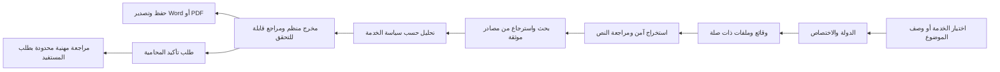
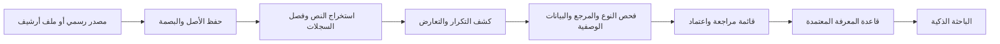
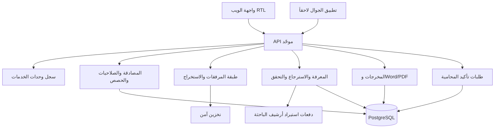

# الخطة التنفيذية الموحّدة لمنصة محاميتك الرقمية بعد التحديث

**الإصدار:** 2.0
**التاريخ:** 6 سبتمبر 2026
**الحالة:** الخطة المرجعية التنفيذية الحالية
**المالك المهني:** المحامية والمحكّم التجاري د. رباب أحمد المعبي
**أولوية التسليم:** الويب أولاً، ثم تطبيق الجوال عبر API موحّد

## الملخص التنفيذي

**محاميتك الرقمية — RABAB LEGAL AI** هي منصة خدمات قانونية عربية في الأنظمة السعودية والخليجية. تعمل جميع الخدمات الرقمية تحت إشراف المحامية والمحكّم التجاري د. رباب أحمد المعبي. تجمع المنصة بين الاستشارة القانونية، والتحليل القضائي للمختصين، والعقود، و**الباحثة الذكية** التي تبحث في المصادر القانونية المؤرشفة والمتحقق منها. القيمة الفارقة ليست مجرد إجابة بالذكاء الاصطناعي؛ بل هي السرية التامة، والتوثيق الخارجي القابل للتحقق، وخيار المستفيد في طلب تأكيد المحامية لمسألة أو مخرج محدد.

لا تمثل المنصة نظام إدارة مكاتب محاماة. لذلك لا يدخل في نطاقها توزيع المهام أو مساحات فرق العمل أو إدارة موظفي المكتب. كما لا يقدم النظام ضمان نتيجة، أو توقع حكم، أو نسبة نجاح، أو تمثيلاً قانونياً آلياً أمام جهة قضائية.

> **المبدأ الحاكم:** لا يصبح أي مخرج قانوني موثقاً لمجرد أن النموذج أنشأه. يجب أن يستند إلى نص أو مصدر معتمد ومتحقق منه، وأن يبيّن حدوده بوضوح. وعند تعذر التحقق، تصرح المنصة بذلك بدلاً من التخمين.

## 1. الهوية والحدود المهنية

تخدم المنصة الأفراد وأصحاب الأعمال والمنشآت الصغيرة في الاستشارة العامة، كما تخدم المحامين والمختصين والإدارات القانونية في الخدمات القضائية المتقدمة. تتعامل مع السعودية والإمارات والكويت وقطر والبحرين وسلطنة عُمان. يجب تحديد الدولة والاختصاص متى كانا مؤثرين في التحليل، ولا يجوز الاستشهاد بنص أو حكم من اختصاص مختلف دون بيان صريح لحدود المقارنة.

| الموضوع | القرار المعتمد | النتيجة التنفيذية |
|---|---|---|
| الإشراف المهني | جميع الخدمات تحت إشراف د. رباب أحمد المعبي | يحمل كل تعريف خدمة ومسار مراجعة هذا الإطار المهني |
| السرية | الوقائع والمرفقات والمخرجات سرية تماماً | عزل خادمي، وصول محدود، روابط تنزيل آمنة، وسجل تدقيق بلا محتوى حساس |
| طبيعة الذكاء الاصطناعي | مساعد للبحث والتنظيم والصياغة الأولية | لا ضمان نتيجة، ولا توقع حكم، ولا اختلاق نص أو مرجع |
| تأكيد المحامية | خيار يبدأه المستفيد صراحةً | لا تصل المراجعة البشرية إلا إلى الحزمة التي اختارها المستفيد |
| المخرجات | قابلة للحفظ والتصدير وفق الصلاحية | Word وPDF بالعربية واتجاه RTL، من دون محتوى داخلي أو بيانات تواصل داخل النص القانوني |
| إدارة المكاتب | خارج النطاق | لا فرق عمل، ولا توزيع مهام، ولا مساحات عمل مشتركة |

## 2. كتالوج الخدمات ودورة حياتها

تعمل المنصة بوحدات خدمة مستقلة. لكل وحدة نطاق اختصاص، ونموذج إدخال، وسياسة مرفقات، وقواعد معرفة وتحقق، وقالب مخرجات، وصلاحيات وحصص، ومسار تأكيد للمحامية. يمنع هذا النموذج عرض خدمات غير ناضجة أو تكرار منطق الملفات والدفع والجودة لكل خدمة جديدة.

| الوحدة | الحالة | الجمهور | المخرجات الرئيسية | القيود المهنية |
|---|---|---|---|---|
| الاستشارة القانونية العامة | نشطة | الأفراد وأصحاب الأعمال | حقوق والتزامات، مواد نظامية، خطوات عملية، جهة مختصة، مستندات ومواعيد | لا تعرض دفوعاً أو تحليل خصم أو نقاط قوة وضعف أو تقدير مركز قانوني |
| الاستشارة القضائية وإدارة القضية | نشطة | المحامون والمختصون والإدارات القانونية | تكييف، أدلة، دفوع، مخاطر، مذكرات، دراسة أحكام | للمختصين وباقات الصلاحية فقط، مع منع توقع الحكم أو ضمان النتيجة |
| تحرير المذكرات والصحائف | نشطة كمسار قضائي | المحامون والمختصون والإدارات القانونية | لوائح دعوى، مذكرات جوابية، استئناف ونقض قابلة للمراجعة | مسودة قانونية ولا تمثل تبنياً أو إيداعاً آلياً |
| العقود | نشطة | الأفراد والأعمال والمختصون | صياغة، مراجعة شاملة، تحليل مخاطر وتوصيات، مراجعة نهائية، استخراج بيانات، وتعديل مقترح | لا يعتمد العقد للتوقيع آلياً ولا يضمن قابليته للتنفيذ |
| الملكية الفكرية | نشطة | الأفراد والأعمال والمختصون | استشارات العلامات وحقوق المؤلف والبراءات والتصاميم والأسرار التجارية والتراخيص | لا يعد المخرج تسجيلاً أو إجراءً رسمياً لدى الجهة المختصة |
| حوكمة وامتثال الشركات | نشطة | الأعمال والإدارات القانونية | تقييم الحوكمة والسياسات والالتزامات والمخاطر وخطة المعالجة | لا يحل محل التدقيق أو الإبلاغ النظامي المطلوب من الجهة المختصة |
| التحكيم التجاري والوساطة | نشطة | الأطراف والمختصون | إدارة الجلسات، محاضر التحكيم، تحليل الأحكام، ومسارات الوساطة والصلح | لا يصدر حكماً أو قراراً تحكيمياً ولا يمثل طرفاً آلياً |
| الصلح والتراضي | نشطة | الأفراد والأعمال والمختصون | محاضر الصلح، اتفاقيات التسوية، ومراجعة المخاطر والثغرات | لا تنعقد التسوية إلا بإرادة الأطراف وإجراءاتها النظامية |
| الباحثة الذكية | نشطة | جميع المستفيدين وفق الصلاحية | بحث في المصادر، مراجع، ملخصات، مقارنة وتحليل منضبط | لا تعرض حكماً أو سابقة أو رابطاً غير متحقق منه |
| توزيع الميراث | مخططة ومخفية | يحدد لاحقاً | حصر البيانات، جدول أنصبة، تقرير Word، طلب تأكيد | لا تظهر أو تقترح أو تحصّل لها حصة حتى يصدر أمر صريح بإظهارها |

### 2.1 خدمة توزيع الميراث المخفية

تظل خدمة توزيع الميراث مسجلة داخل السجل التشغيلي فقط بحالة `planned`. لا تظهر في واجهة الويب أو الجوال أو قائمة الخدمات أو نتائج البحث أو موجّه الموضوعات أو الباقات أو API العام. لا يسمح ببدء جلسة أو دفع أو خصم حصة لهذه الخدمة. يستفاد من نموذج منصة «مواريث» في تصور الإدخال: بيانات المورّث والتركة، الديون والوصية، الورثة وصفاتهم، ورفع حصر الورثة، ثم جدول قسمة وتقرير Word [3].

لا يُظهر اسم الخدمة إلا بعد أمر صريح من د. رباب، وبعد اعتماد نطاقها القانوني ومصادرها وقواعد الحالات الاستثنائية ونموذج المراجعة البشرية وقالب Word واختبارات الأمان والدقة.

## 3. مسار المستفيد الموحد

يبدأ المستفيد باختيار خدمة أو وصف موضوعه. تحدد المنصة الدولة والاختصاص وتجمع الوقائع والبيانات اللازمة، ثم تتيح رفع الملفات المرتبطة ضمن الصيغ والحدود المعلنة. تعالج الملفات مرة واحدة، وتحفظ النص المستخرج وربطه بالمالك والجلسة، ثم ترسل إلى محرك التحليل المقاطع المرتبطة فقط بدلاً من تمرير الملف كاملاً.

تعرض النتيجة في أقسام واضحة تميّز بين النص النظامي واللائحة والقرار والحكم أو المبدأ القضائي والرأي التحليلي والممارسة العملية. يستطيع المستفيد حفظ النتيجة، وتنزيلها بصيغة Word أو PDF وفق صلاحيته، أو طلب تأكيد المحامية. لا تتضمن النسخة المصدرة أسماء الملفات، أو تفاصيل أرشيف المعرفة الداخلي، أو بيانات التواصل داخل النص القانوني.

### 3.1 طلب تأكيد المحامية

طلب التأكيد هو مسار مستقل، لا عبارة تسويقية داخل المخرج. يبدأه المستفيد من نتيجة أو استشارة أو عقد، ويحدد ما إذا كان يريد تأكيد الاستشارة أو مراجعة مستند أو توضيح نقطة بعينها. تنشئ المنصة حزمة محددة تتضمن ملخص الطلب والاختصاص والنتيجة والمراجع والمرفقات التي اختارها فقط. يسجل النظام وقت الطلب ونطاقه وحالته وكل عملية وصول ذات صلة.

| الحالة | معناها | حق الوصول |
|---|---|---|
| `requested` | أنشأ المستفيد الطلب وحدد النطاق | المستفيد فقط |
| `assigned` | أسندت الحزمة للمراجعة المهنية | المراجع المخوّل للحزمة المحددة |
| `in_review` | بدأت مراجعة د. رباب أو من تفوضه ضمن السياسة | إضافة ملاحظات مهنية مسجلة |
| `returned` | أرسل الرد أو طلبت معلومات إضافية | المستفيد، مع التنزيل حسب الصلاحية |
| `closed` | اكتملت المراجعة أو أغلق الطلب | سجل تدقيقي واحتفاظ بحسب السياسة |

لا تتعهد المنصة بزمن أو سعر أو نتيجة لطلب التأكيد قبل اعتماد قواعد الباقات والأسعار. لا يعد إنشاء الطلب رأياً قانونياً ملزماً بحد ذاته.

## 4. الباحثة الذكية والأرشيف القانوني

### 4.1 دور الباحثة الذكية

الباحثة الذكية خدمة أساسية لا يجوز حذفها أو تعطيلها. تبحث في الأحكام والسوابق والمدونات القضائية والتعاميم والقرارات والمبادئ والأنظمة واللوائح وما يدعم دراسة القضية وموقف الموكل. تتبع واجهة العرض التجريبية نموذجاً عملياً مفيداً في تقسيم البحث إلى أقسام، وتصفية النتائج حسب الاختصاص والجهة والسنة، وإظهار نوع الوثيقة ومصدرها [2]. لكن واجهة العرض ليست واجهة إنتاجية ولا مصدراً قانونياً نهائياً بحد ذاتها.

| نوع المحتوى | بيانات العرض الإلزامية | إجراء عدم التحقق |
|---|---|---|
| نظام أو لائحة | الاسم، المادة، الجهة، حالة النفاذ أو التعديل، الرابط الرسمي عند توفره | لا ينشأ رقم مادة أو نص بديل |
| تعميم أو قرار | الرقم، التاريخ، الجهة، الموضوع، والرابط الرسمي عند توفره | لا يعرض كسند ملزم إذا تعذر التحقق |
| حكم أو سابقة | رقم القضية، رقم الحكم أو الصك، المحكمة، التاريخ، الموضوع، المبدأ، الرابط أو طريقة الوصول | يصرح بتعذر العثور على سابقة موثقة بدلاً من اختلاقها |
| مبدأ قضائي | المرجع والجهة والمحكمة أو جهة النشر والمصدر | لا ينسب لجهة رسمية بلا مرجع |
| رأي تحليلي | أساس التحليل وحدوده وما يحتاج إلى بيانات إضافية | لا يقدم بوصفه نصاً أو حكماً |

### 4.2 أرشيف الباحثة الذكية

المستودع الخاص للباحثة الذكية [1] هو طبقة حفظ وفهرسة مستقلة، وليس قاعدة بيانات إنتاجية تُقرأ مباشرة من واجهة المستفيد. يحفظ الأصول دون تعديل، ويستخدم بصمة SHA-256، ويربط كل سجل بمصدره وصفحاته، ويفصل الأحكام والصكوك والتعاميم والقرارات والمدونات والمبادئ والسابقة القضائية. يمنع التكرار بالبصمة أولاً ثم بمقارنة المرجع والمحتوى، ويحيل الحالات غير الحاسمة إلى المراجعة.

تستمر أعمال السحب والفهرسة في محادثة مستقلة وعلى فرع الأرشفة المخصص. لا ينتقل أي ملف جديد مباشرة إلى قاعدة المعرفة في «محاميتك الرقمية». تدخل الوثائق عبر دفعة استيراد موثقة، تمر بفحص للمعرف الفريد والنوع والعنوان وبصمة النص والمرجع ومصدر الأصل، ثم تنضم إلى قائمة مراجعة قبل اعتمادها للفهرسة الموثوقة.

لا تظهر للمستفيد أسماء المستودعات أو مسارات الملفات أو البصمات أو أسماء الملفات أو منهج التخزين. يظهر فقط المصدر الخارجي المسموح بعرضه، مثل الرابط الحكومي الرسمي، أو طريقة الوصول إلى الحكم عندما لا يتوفر رابط مباشر.

### 4.3 منهجية البحث والتحقق

تجمع الباحثة بين البحث الحرفي للتطابقات المباشرة والبحث الدلالي للمصطلحات والمرادفات، مع إعادة ترتيب وإزالة التكرار. يقيد الاسترجاع بالدولة والاختصاص ونوع المصدر وحالة السريان. يفرق النظام بين الناشر ومصدر الأصل النظامي أو القضائي. لا يُرسل إلى النموذج كامل المستند افتراضياً؛ بل المقاطع ذات الصلة مع سياقها وبياناتها الوصفية.

لا تعرض المنصة مصدر معرفة داخلياً بوصفه مرجعاً للمستفيد. وعند عدم العثور على مصدر رسمي متحقق منه، تستخدم الصياغة المعتمدة: **«تعذر العثور على سابقة قضائية موثقة برابط مباشر وفق المصادر الرسمية المتاحة.»**

## 5. المرفقات، السرية، وWord

تقبل كل خدمة نشطة ملفات PDF وDOCX وTXT والصور المدعومة ضمن حدود حجم وصيغ معلنة. يفحص الخادم نوع الملف وحجمه ومالكه قبل المعالجة. يظهر للمستفيد وضع الرفع والاستخراج ووجود OCR وقص النص عند تجاوز الحد. لا يسجل محتوى المستندات أو الأسرار في سجلات الخطأ، ولا تستخدم الملفات أو المحادثات أو المخرجات في تدريب النماذج أو التسويق.

| طبقة الحماية | الضابط | اختبار القبول |
|---|---|---|
| العزل | ربط كل ملف ونتيجة وجلسة وطلب تأكيد بمالك وصلاحية خادمية | لا يستطيع مستخدم آخر الوصول للمورد بالتخمين أو بالرابط |
| التخزين | تشفير وتحديد مدة الاحتفاظ وحذف آمن | لا يبقى الملف متاحاً بعد الحذف أو انتهاء الرابط |
| التنزيل | روابط موقعة قصيرة العمر والتحقق من الصلاحية | يفشل فتح الرابط المنتهي أو غير المصرح به |
| السجلات | تسجيل الفعل والوقت والمورد دون محتوى حساس | لا يظهر النص المستخرج أو الملف في سجل الخطأ |
| المراجعة البشرية | مشاركة فقط في نطاق طلب المستفيد | لا تظهر المرفقات غير المختارة للمراجع |

تعد نسخة Word مخرجاً أساسياً للمحتوى القابل للحفظ. تحفظ عنوان الخدمة، والتاريخ، والاختصاص عند وجوده، والمراجع، وإخلاء المسؤولية المناسب، وتستخدم اتجاه RTL وخطاً صالحاً للعربية. يمنع تضمين رموز Markdown الخام أو بيانات تواصل داخل المخرج القانوني أو أي محتوى داخلي غير مصرح به.

## 6. المعمارية التقنية المستهدفة

تظل المعمارية مبنية على React/Vite/Tailwind للويب، وExpress/TypeScript لخادم API، وPostgreSQL/Drizzle للبيانات. يأتي تطبيق الجوال لاحقاً باستخدام الحساب وAPI نفسيهما. لا يصل الويب أو الجوال مباشرة إلى قاعدة البيانات أو مفاتيح الذكاء الاصطناعي أو مفاتيح الدفع.

### 6.1 سجل وحدات الخدمات

سجل الخادم هو مصدر الحقيقة لحالة الخدمات وقدراتها. يفرق بين `planned` و`active` و`retired`. لا يعلن API العام إلا الخدمات النشطة. لذلك تبقى خدمة توزيع الميراث مخفية من الواجهة ومن `GET /api/service-modules` ومن موجّه الموضوعات إلى أن تصدر صاحبة المنصة أمراً صريحاً بالإظهار عقب بوابة الاعتماد.

### 6.2 العقود ذات الأولوية

| العملية | حالة التنفيذ | ضابط أساسي |
|---|---|---|
| `GET /api/service-modules` | منفذ | يعرض الخدمات النشطة فقط، من دون خدمات مخططة أو منطق داخلي |
| تشغيل خدمة موحدة | مخطط | يرفض أي خدمة غير نشطة ويطبق الحصة والصلاحية على الخادم |
| رفع واستخراج ملف موحد | يحتاج توحيد | يتحقق من المالك والنوع والحجم ويعيد حالة معالجة واضحة |
| استيراد أرشيف الباحثة | مخطط | يعتمد إصداراً محدداً ويضع النتائج في قائمة مراجعة قبل الفهرسة |
| حفظ نتائج الخدمة وتصدير Word | موجود جزئياً ويحتاج توحيد | يربط النتيجة بالمالك والخدمة والمصادر وحالة التحقق |
| طلب تأكيد المحامية | مخطط | يتطلب موافقة صريحة ونطاق مرفقات محدداً |

## 7. خارطة التنفيذ ذات الأولوية

لا تبدأ مرحلة قبل إقفال معيار قبول المرحلة السابقة. لا تؤدي إضافة خدمة مستقبلية إلى تأجيل معالجة أمان الملفات أو جودة المعرفة أو التحقق القانوني للخدمات النشطة.

| المرحلة | الأولوية | العمل | معيار القبول |
|---|---|---|---|
| 1. تثبيت المواصفات | عالية | اعتماد هذه الخطة ومواءمة وثائق المنتج | لا تعارض بين الخدمة والسرية والمخرجات والمحظورات |
| 2. أتمتة الأرشيف في مسار مستقل | عالية | استكمال السحب والفصل والفهرسة في مستودع الباحثة فقط | حفظ الأصل والبصمة والمرجع، مع تقرير للفشل والتكرار والمراجعة |
| 3. دفعة استيراد الباحثة | عالية | بناء استيراد قابل للتتبع إلى قائمة مراجعة RABAB LEGAL AI | لا يدخل مصدر إلى البحث الموثوق قبل فحص واعتماد بشري |
| 4. طبقة المرفقات الموحدة | عالية | توحيد الرفع والاستخراج وOCR والعزل عبر كل خدمة نشطة | اجتياز اختبارات الصيغة والحجم والملكية وانتهاء الرابط والسجل |
| 5. توحيد المخرجات وWord | عالية | قوالب DOCX RTL مرتبطة بالخدمة والصلاحية | يفتح كل ملف سليماً ولا يتسرب فيه محتوى داخلي |
| 6. طلب تأكيد المحامية | متوسطة | إنشاء الطلب والحزمة المحدودة وحالات المراجعة وسجل الوصول | لا يصل مراجع إلى حالة أو مرفق بلا طلب صريح من المستفيد |
| 7. بوابة جودة الخدمات | عالية | اختبارات المصادر والاختصاصات والحصص والدفع والمرفقات | لا خطأ حرج في العزل أو التوثيق أو الصلاحيات |
| 8. تطبيق الجوال | متوسطة | نقل الخدمات المستقرة إلى الجوال عبر API موحد | تطابق الصلاحيات والحصص وحالات الملفات والنتائج مع الويب |
| 9. إعداد توزيع الميراث | مؤجل ومخفي | تصميم الوحدة المتخصصة دون عرضها للمستفيد | لا تغيير للحالة إلى `active` ولا أمر إظهار قبل اعتماد د. رباب |

## 8. بوابة الإطلاق والاختبارات الإلزامية

لا ينشر أي مسار إنتاجي قبل اجتياز الاختبارات الوظيفية والأمنية والمهنية. تشمل بوابة الجودة اختبار أن المصدر غير الموثق لا يظهر كمرجع قانوني، وأن الحكم بلا رابط مباشر لا يعرض إلا إذا كانت طريقة الوصول الرسمية موثقة، وأن الاستشارة العامة لا تتجاوز حدودها، وأن ملفات مستخدم لا تظهر لمستخدم آخر أو لمراجع غير مخول.

| الاختبار | النتيجة المقبولة |
|---|---|
| مصدر أو رقم حكم غير متحقق | لا يعرض، وتظهر صياغة تعذر التحقق |
| اختلاف الاختصاص | يمنع خلط الدولة أو يبين حد المقارنة صراحةً |
| ملف مستخدم أ | لا يستطيع مستخدم ب أو رابط منتهي الوصول إليه |
| طلب تأكيد المحامية | لا يشارك إلا الحزمة المحددة من المستفيد وتظهر كل حالة في السجل |
| مخرج Word | RTL سليم، مصادر وإخلاء مناسب، ولا رموز خام أو بيانات اتصال داخل النص |
| أرشيف الباحثة | لا يفهرس سجل بلا معرف ونوع وعنوان وبصمة ومرجع، ولا يعد التكرار مرتين |
| خدمة توزيع الميراث | مخفية تماماً من الواجهة وAPI العام والتوجيه والحصة والدفع |
| الجوال | يستخدم API نفسه ولا يحتوي أسرار الخدمات أو منطق الفهرسة |

## 9. وضع النطاقات والروابط

الرابط التجريبي للباحثة الذكية هو مرجع وظيفي داخلي فقط، ولا يُدمج أو ينشر للمستفيدين قبل مراجعة أمنه وتثبيت عقد API وتطبيق هوية المنصة [2]. أما النطاق `albahitha.com` فهو مسجل حالياً ولا توجد له استجابة DNS عامة وقت المراجعة؛ لذلك لا يلزم شراؤه مجدداً. لا يُغير DNS أو يستضاف عليه المحتوى أو يربط بالإنتاج في هذه الخطة. يتطلب ذلك قراراً مستقلاً يحدد الوجهة النهائية، وملكية النطاق، وشهادة TLS، وسياسة الخصوصية، وخطة الرجوع.

## الخلاصة

تجعل هذه الخطة «محاميتك الرقمية» منصة قانونية قابلة للنمو من دون التضحية بالسرية أو التحقق أو الإشراف المهني. تبقى الخدمات الأساسية متاحة وفق ضوابطها، وتصبح الباحثة الذكية طبقة معرفة منظمة تستفيد من أرشيف مستقل ومراجع رسمية، ويُتاح للمستفيد طلب تأكيد المحامية بصورة صريحة ومحدودة. أما توزيع الميراث فيبقى خدمة داخلية مخططة ومخفية حتى أمر الإظهار والاعتماد المهني الكامل.

## المراجع

[1]: https://github.com/drrabab-almobi-dot/smart-legal-researcher-archive "أرشيف الباحثة الذكية"
[2]: https://smart-legal-researcher.s3t3-9306.chatgpt.site/ "الباحثة القانونية الذكية — واجهة العرض التجريبية"
[3]: https://mawaarith.com/ "مواريث — حاسبة المواريث السعودية"
